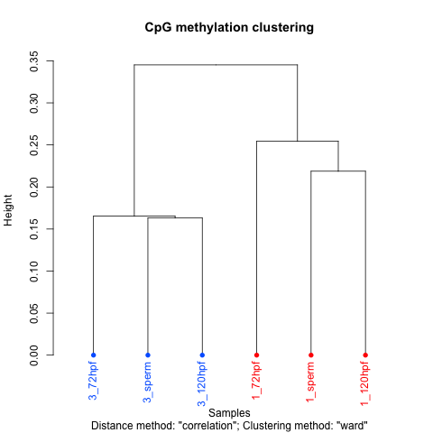
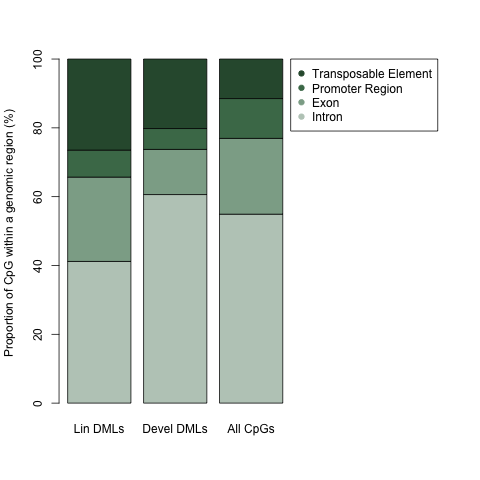

## IPython Notebook for downloading and analyzing data for the manusript: "Indication of family-specific DNA methylation patterns in developing oysters"

bioRix preprint - [http://dx.doi.org/10.1101/012831](http://dx.doi.org/10.1101/012831)

---
To execute the IPython Notebook in its entirety you will need:   

* IPython - [install instructions](http://ipython.org/install.html)    
* BSMAP - [install instructions](https://code.google.com/p/bsmap/)   
* bedtools - [install instructions](https://github.com/arq5x/bedtools2/releases/tag/v2.22.0)    
* R - [install instructions](http://www.r-project.org/)  
* rpy2 (interface to R from Python) - [install instructions](http://rpy.sourceforge.net/)   


---

Sofware versions originally used in this analyses (on Mac OS X v10.7.5) are as follows: 

* IPython: 2.3.0   
* BSMAP: 2.74   
* bedtools: 2.17.0   
* R: 3.1.1  
* rpy2: 2.5.0   


The intent is to download the github repository locally and run so accompaning scripts, etc. are available.
Detailed Instructions are provided in [GitHub Repo Readme](https://github.com/che625/olson-ms-nb).
Please note Data files that you will download and will produce are large (>20Gb).


The notebook is divided into 5 sections 

* [Downloading data](#Downloading-Files) 

* [Read aligning: BSMAP](#Running-BSMAP) 

* [Global differences: methylkit](#Global-Differences:-methylkit)  

* [Differentially methylated loci: methylkit](#Differentially-methylated-loci)  

* [Genomic location of DMLs: bedtools](#Genomic-location-of-DMLs)   


Please post any comments and questions in [issues](https://github.com/che625/olson-ms-nb/issues).

---

Before getting started, set the location of BSMAP on your computer and hit shift-enter


    bsmaploc="/Applications/bioinfo/BSMAP/bsmap-2.42/"

# Downloading Data


    #to confirm you current directory run the command and you should see a wd directory
    !ls


    BiGo_dev.ipynb README.md      scripts        wd


    cd wd

    /Users/sr320/git-repos/olson-ms-nb/wd


    #This command downloads a archived file including six BS-seq libraries (4.3 Gb)
    
    #!wget http://eagle.fish.washington.edu/trilobite/Crassostrea_gigas_HTSdata/BiGo_lar_fastq_mcf.tgz
    !curl -O http://eagle.fish.washington.edu/trilobite/Crassostrea_gigas_HTSdata/BiGo_lar_fastq_mcf.tgz    


      % Total    % Received % Xferd  Average Speed   Time    Time     Time  Current
                                     Dload  Upload   Total   Spent    Left  Speed
    100 4221M  100 4221M    0     0  61.3M      0  0:01:08  0:01:08 --:--:-- 82.1M


    #uncompress files
    !tar -zxvf BiGo_lar_fastq_mcf.tgz

    x mcf_M1_R1.fastq
    x mcf_M1_R2.fastq
    x mcf_M3_R1.fastq
    x mcf_M3_R2.fastq
    x mcf_T1D3_R1.fastq
    x mcf_T1D3_R2.fastq
    x mcf_T1D5_R1.fastq
    x mcf_T1D5_R2.fastq
    x mcf_T3D3_R1.fastq
    x mcf_T3D3_R2.fastq
    x mcf_T3D5_R1.fastq
    x mcf_T3D5_R2.fastq


    #remove BiGo_lar_fastq_mcf.tgz
    #!rm BiGo_lar_fastq_mcf.tgz 


    #Downloading the oyster genome 
    #!wget http://eagle.fish.washington.edu/trilobite/Crassostrea_gigas_ensembl_tracks/Crassostrea_gigas.GCA_000297895.1.22.dna_sm.genome.fa
    !curl -O http://eagle.fish.washington.edu/trilobite/Crassostrea_gigas_ensembl_tracks/Crassostrea_gigas.GCA_000297895.1.22.dna_sm.genome.fa    
        

      % Total    % Received % Xferd  Average Speed   Time    Time     Time  Current
                                     Dload  Upload   Total   Spent    Left  Speed
    100  541M  100  541M    0     0  71.5M      0  0:00:07  0:00:07 --:--:-- 73.1M


# Running BSMAP


    for i in ("M1","T1D3","T1D5", "M3", "T3D3", "T3D5"):
        !{bsmaploc}bsmap \
    -a mcf_{i}_R1.fastq \
    -b mcf_{i}_R2.fastq \
    -d Crassostrea_gigas.GCA_000297895.1.22.dna_sm.genome.fa \
    -o bsmap_out_{i}.sam \
    -p 8

    
    BSMAP v2.74
    Start at:  Tue Dec  2 14:03:03 2014
    
    Input reference file: Crassostrea_gigas.GCA_000297895.1.22.dna_sm.genome.fa 	(format: FASTA)
    Load in 7658 db seqs, total size 557717710 bp. 9 secs passed
    total_kmers: 43046721
    Create seed table. 25 secs passed
    max number of mismatches: read_length * 8% 	max gap size: 0
    kmer cut-off ratio: 5e-07
    max multi-hits: 100	max Ns: 5	seed size: 16	index interval: 4
    quality cutoff: 0	base quality char: '!'
    min fragment size:28	max fragemt size:500
    start from read #1	end at read #4294967295
    additional alignment: T in reads => C in reference
    mapping strand (read_1): ++,-+
    mapping strand (read_2): +-,--
    Pair-end alignment(4 threads)
    Input read file #1: mcf_M1_R1.fastq 	(format: FASTQ)
    Input read file #2: mcf_M1_R2.fastq 	(format: FASTQ)
    Output file: bsmap_out_M1.sam	 (format: SAM)
    Thread #1: 	100000 read pairs finished. 44 secs passed
    Thread #3: 	50000 read pairs finished. 45 secs passed
    Thread #0: 	150000 read pairs finished. 45 secs passed
    Thread #2: 	200000 read pairs finished. 46 secs passed
    Thread #1: 	250000 read pairs finished. 61 secs passed
    Thread #3: 	300000 read pairs finished. 62 secs passed
    Thread #0: 	350000 read pairs finished. 63 secs passed
    Thread #2: 	400000 read pairs finished. 64 secs passed
    Thread #1: 	450000 read pairs finished. 78 secs passed
    Thread #3: 	500000 read pairs finished. 79 secs passed
    Thread #0: 	550000 read pairs finished. 81 secs passed
    Thread #2: 	600000 read pairs finished. 81 secs passed
    Thread #1: 	650000 read pairs finished. 95 secs passed
    Thread #3: 	700000 read pairs finished. 97 secs passed
    Thread #0: 	750000 read pairs finished. 98 secs passed
    Thread #2: 	800000 read pairs finished. 99 secs passed
    Thread #1: 	850000 read pairs finished. 113 secs passed
    Thread #3: 	900000 read pairs finished. 114 secs passed
    Thread #2: 	1000000 read pairs finished. 116 secs passed
    Thread #0: 	950000 read pairs finished. 117 secs passed
    Thread #1: 	1050000 read pairs finished. 129 secs passed
    Thread #3: 	1100000 read pairs finished. 132 secs passed
    Thread #2: 	1150000 read pairs finished. 133 secs passed
    Thread #0: 	1200000 read pairs finished. 135 secs passed
    Thread #1: 	1250000 read pairs finished. 146 secs passed
    Thread #3: 	1300000 read pairs finished. 149 secs passed
    Thread #2: 	1350000 read pairs finished. 150 secs passed
    Thread #0: 	1400000 read pairs finished. 153 secs passed
    Thread #1: 	1450000 read pairs finished. 163 secs passed
    Thread #3: 	1500000 read pairs finished. 166 secs passed
    Thread #2: 	1550000 read pairs finished. 167 secs passed
    Thread #0: 	1600000 read pairs finished. 169 secs passed
    Thread #1: 	1650000 read pairs finished. 181 secs passed
    Thread #3: 	1700000 read pairs finished. 184 secs passed
    Thread #2: 	1750000 read pairs finished. 185 secs passed
    Thread #0: 	1800000 read pairs finished. 187 secs passed
    Thread #1: 	1850000 read pairs finished. 198 secs passed
    Thread #3: 	1900000 read pairs finished. 202 secs passed
    Thread #2: 	1950000 read pairs finished. 202 secs passed
    Thread #0: 	2000000 read pairs finished. 205 secs passed
    Thread #1: 	2050000 read pairs finished. 215 secs passed
    Thread #3: 	2100000 read pairs finished. 219 secs passed
    Thread #2: 	2150000 read pairs finished. 219 secs passed
    Thread #0: 	2200000 read pairs finished. 222 secs passed
    Thread #1: 	2250000 read pairs finished. 233 secs passed
    Thread #2: 	2350000 read pairs finished. 237 secs passed
    Thread #3: 	2300000 read pairs finished. 237 secs passed
    Thread #0: 	2400000 read pairs finished. 239 secs passed
    Thread #1: 	2450000 read pairs finished. 249 secs passed
    Thread #3: 	2550000 read pairs finished. 255 secs passed
    Thread #2: 	2500000 read pairs finished. 255 secs passed
    Thread #0: 	2600000 read pairs finished. 256 secs passed
    Thread #1: 	2650000 read pairs finished. 267 secs passed
    Thread #3: 	2700000 read pairs finished. 273 secs passed
    Thread #2: 	2750000 read pairs finished. 273 secs passed
    Thread #0: 	2800000 read pairs finished. 274 secs passed
    Thread #1: 	2850000 read pairs finished. 284 secs passed
    Thread #2: 	2950000 read pairs finished. 291 secs passed
    Thread #3: 	2900000 read pairs finished. 291 secs passed
    Thread #0: 	3000000 read pairs finished. 291 secs passed
    Thread #1: 	3050000 read pairs finished. 301 secs passed
    Thread #2: 	3100000 read pairs finished. 308 secs passed
    Thread #3: 	3150000 read pairs finished. 309 secs passed
    Thread #0: 	3200000 read pairs finished. 309 secs passed
    Thread #1: 	3250000 read pairs finished. 318 secs passed
    Thread #2: 	3300000 read pairs finished. 325 secs passed
    Thread #3: 	3350000 read pairs finished. 326 secs passed
    Thread #0: 	3400000 read pairs finished. 326 secs passed
    Thread #1: 	3450000 read pairs finished. 334 secs passed
    Thread #2: 	3500000 read pairs finished. 342 secs passed
    Thread #3: 	3550000 read pairs finished. 344 secs passed
    Thread #0: 	3600000 read pairs finished. 345 secs passed
    Thread #1: 	3650000 read pairs finished. 353 secs passed
    Thread #2: 	3700000 read pairs finished. 360 secs passed
    Thread #3: 	3750000 read pairs finished. 362 secs passed
    Thread #0: 	3800000 read pairs finished. 362 secs passed
    Thread #1: 	3850000 read pairs finished. 370 secs passed
    Thread #2: 	3900000 read pairs finished. 377 secs passed
    Thread #3: 	3950000 read pairs finished. 379 secs passed
    Thread #0: 	4000000 read pairs finished. 379 secs passed
    Thread #1: 	4050000 read pairs finished. 388 secs passed
    Thread #2: 	4100000 read pairs finished. 394 secs passed
    Thread #3: 	4150000 read pairs finished. 396 secs passed
    Thread #0: 	4200000 read pairs finished. 396 secs passed
    Thread #1: 	4250000 read pairs finished. 405 secs passed
    Thread #2: 	4300000 read pairs finished. 412 secs passed
    Thread #3: 	4350000 read pairs finished. 413 secs passed
    Thread #0: 	4400000 read pairs finished. 414 secs passed
    Thread #1: 	4450000 read pairs finished. 423 secs passed
    Thread #2: 	4500000 read pairs finished. 429 secs passed
    Thread #3: 	4550000 read pairs finished. 430 secs passed
    Thread #0: 	4600000 read pairs finished. 432 secs passed
    Thread #1: 	4650000 read pairs finished. 440 secs passed
    Thread #2: 	4700000 read pairs finished. 446 secs passed
    Thread #3: 	4750000 read pairs finished. 448 secs passed
    Thread #0: 	4800000 read pairs finished. 449 secs passed
    Thread #1: 	4850000 read pairs finished. 457 secs passed
    Thread #2: 	4900000 read pairs finished. 464 secs passed
    Thread #3: 	4950000 read pairs finished. 465 secs passed
    Thread #0: 	5000000 read pairs finished. 466 secs passed
    Thread #1: 	5050000 read pairs finished. 474 secs passed
    Thread #2: 	5100000 read pairs finished. 480 secs passed
    Thread #3: 	5150000 read pairs finished. 482 secs passed
    Thread #0: 	5200000 read pairs finished. 483 secs passed
    Thread #1: 	5250000 read pairs finished. 491 secs passed
    Thread #2: 	5300000 read pairs finished. 499 secs passed
    Thread #3: 	5350000 read pairs finished. 499 secs passed
    Thread #0: 	5400000 read pairs finished. 500 secs passed
    Thread #1: 	5450000 read pairs finished. 508 secs passed
    Thread #2: 	5500000 read pairs finished. 516 secs passed
    Thread #3: 	5550000 read pairs finished. 517 secs passed
    Thread #0: 	5600000 read pairs finished. 518 secs passed
    Thread #1: 	5650000 read pairs finished. 526 secs passed
    Thread #2: 	5700000 read pairs finished. 533 secs passed
    Thread #3: 	5750000 read pairs finished. 534 secs passed
    Thread #0: 	5800000 read pairs finished. 535 secs passed
    Thread #1: 	5850000 read pairs finished. 543 secs passed
    Thread #2: 	5900000 read pairs finished. 552 secs passed
    Thread #3: 	5950000 read pairs finished. 553 secs passed
    Thread #0: 	6000000 read pairs finished. 554 secs passed
    Thread #1: 	6050000 read pairs finished. 561 secs passed
    Thread #2: 	6100000 read pairs finished. 569 secs passed
    Thread #3: 	6150000 read pairs finished. 570 secs passed
    Thread #0: 	6200000 read pairs finished. 571 secs passed
    Thread #1: 	6250000 read pairs finished. 579 secs passed
    Thread #2: 	6300000 read pairs finished. 588 secs passed
    Thread #3: 	6350000 read pairs finished. 588 secs passed
    Thread #0: 	6400000 read pairs finished. 589 secs passed
    Thread #1: 	6450000 read pairs finished. 597 secs passed
    Thread #2: 	6500000 read pairs finished. 605 secs passed
    Thread #3: 	6550000 read pairs finished. 606 secs passed
    Thread #0: 	6600000 read pairs finished. 606 secs passed
    Thread #1: 	6650000 read pairs finished. 614 secs passed
    Thread #2: 	6700000 read pairs finished. 623 secs passed
    Thread #3: 	6750000 read pairs finished. 623 secs passed
    Thread #0: 	6800000 read pairs finished. 624 secs passed
    Thread #1: 	6850000 read pairs finished. 631 secs passed
    Thread #2: 	6900000 read pairs finished. 640 secs passed
    Thread #3: 	6950000 read pairs finished. 641 secs passed
    Thread #0: 	7000000 read pairs finished. 641 secs passed
    Thread #1: 	7050000 read pairs finished. 649 secs passed
    Thread #2: 	7100000 read pairs finished. 657 secs passed
    Thread #3: 	7150000 read pairs finished. 659 secs passed
    Thread #0: 	7200000 read pairs finished. 659 secs passed
    Thread #1: 	7250000 read pairs finished. 666 secs passed
    Thread #2: 	7300000 read pairs finished. 674 secs passed
    Thread #3: 	7350000 read pairs finished. 676 secs passed
    Thread #0: 	7400000 read pairs finished. 677 secs passed
    Thread #1: 	7450000 read pairs finished. 683 secs passed
    Thread #2: 	7500000 read pairs finished. 692 secs passed
    Thread #3: 	7550000 read pairs finished. 693 secs passed
    Thread #0: 	7600000 read pairs finished. 694 secs passed
    Thread #1: 	7650000 read pairs finished. 699 secs passed
    Thread #2: 	7700000 read pairs finished. 709 secs passed
    Thread #3: 	7750000 read pairs finished. 710 secs passed
    Thread #0: 	7800000 read pairs finished. 711 secs passed
    Thread #1: 	7850000 read pairs finished. 717 secs passed
    Thread #1: 	8023643 read pairs finished. 725 secs passed
    Thread #2: 	7900000 read pairs finished. 726 secs passed
    Thread #3: 	7950000 read pairs finished. 726 secs passed
    Thread #0: 	8000000 read pairs finished. 727 secs passed
    Total number of aligned reads: 
    pairs:       3982551 (50%)
    single a:    1489442 (19%)
    single b:    1430646 (18%)
    Done.
    Finished at Tue Dec  2 14:15:10 2014
    Total time consumed:  727 secs
    
    BSMAP v2.74
    Start at:  Tue Dec  2 14:15:11 2014
    
    Input reference file: Crassostrea_gigas.GCA_000297895.1.22.dna_sm.genome.fa 	(format: FASTA)
    Load in 7658 db seqs, total size 557717710 bp. 9 secs passed
    total_kmers: 43046721
    Create seed table. 25 secs passed
    max number of mismatches: read_length * 8% 	max gap size: 0
    kmer cut-off ratio: 5e-07
    max multi-hits: 100	max Ns: 5	seed size: 16	index interval: 4
    quality cutoff: 0	base quality char: '!'
    min fragment size:28	max fragemt size:500
    start from read #1	end at read #4294967295
    additional alignment: T in reads => C in reference
    mapping strand (read_1): ++,-+
    mapping strand (read_2): +-,--
    Pair-end alignment(4 threads)
    Input read file #1: mcf_T1D3_R1.fastq 	(format: FASTQ)
    Input read file #2: mcf_T1D3_R2.fastq 	(format: FASTQ)
    Output file: bsmap_out_T1D3.sam	 (format: SAM)
    Thread #3: 	50000 read pairs finished. 39 secs passed
    Thread #0: 	100000 read pairs finished. 39 secs passed
    Thread #1: 	150000 read pairs finished. 40 secs passed
    Thread #2: 	200000 read pairs finished. 40 secs passed
    Thread #3: 	250000 read pairs finished. 54 secs passed
    Thread #0: 	300000 read pairs finished. 54 secs passed
    Thread #1: 	350000 read pairs finished. 55 secs passed
    Thread #2: 	400000 read pairs finished. 55 secs passed
    Thread #3: 	450000 read pairs finished. 68 secs passed
    Thread #0: 	500000 read pairs finished. 68 secs passed
    Thread #2: 	600000 read pairs finished. 69 secs passed
    Thread #1: 	550000 read pairs finished. 69 secs passed
    Thread #3: 	650000 read pairs finished. 82 secs passed
    Thread #0: 	700000 read pairs finished. 83 secs passed
    Thread #2: 	750000 read pairs finished. 83 secs passed
    Thread #1: 	800000 read pairs finished. 83 secs passed
    Thread #3: 	850000 read pairs finished. 96 secs passed
    Thread #0: 	900000 read pairs finished. 97 secs passed
    Thread #2: 	950000 read pairs finished. 97 secs passed
    Thread #1: 	1000000 read pairs finished. 98 secs passed
    Thread #3: 	1050000 read pairs finished. 110 secs passed
    Thread #0: 	1100000 read pairs finished. 111 secs passed
    Thread #2: 	1150000 read pairs finished. 111 secs passed
    Thread #1: 	1200000 read pairs finished. 111 secs passed
    Thread #3: 	1250000 read pairs finished. 124 secs passed
    Thread #0: 	1300000 read pairs finished. 125 secs passed
    Thread #2: 	1350000 read pairs finished. 125 secs passed
    Thread #1: 	1400000 read pairs finished. 126 secs passed
    Thread #3: 	1450000 read pairs finished. 137 secs passed
    Thread #0: 	1500000 read pairs finished. 139 secs passed
    Thread #2: 	1550000 read pairs finished. 140 secs passed
    Thread #1: 	1600000 read pairs finished. 140 secs passed
    Thread #3: 	1650000 read pairs finished. 151 secs passed
    Thread #0: 	1700000 read pairs finished. 153 secs passed
    Thread #2: 	1750000 read pairs finished. 154 secs passed
    Thread #1: 	1800000 read pairs finished. 154 secs passed
    Thread #3: 	1850000 read pairs finished. 165 secs passed
    Thread #0: 	1900000 read pairs finished. 168 secs passed
    Thread #2: 	1950000 read pairs finished. 168 secs passed
    Thread #1: 	2000000 read pairs finished. 168 secs passed
    Thread #3: 	2050000 read pairs finished. 179 secs passed
    Thread #2: 	2150000 read pairs finished. 182 secs passed
    Thread #0: 	2100000 read pairs finished. 182 secs passed
    Thread #1: 	2200000 read pairs finished. 182 secs passed
    Thread #3: 	2250000 read pairs finished. 192 secs passed
    Thread #2: 	2300000 read pairs finished. 195 secs passed
    Thread #1: 	2400000 read pairs finished. 196 secs passed
    Thread #0: 	2350000 read pairs finished. 196 secs passed
    Thread #3: 	2450000 read pairs finished. 205 secs passed
    Thread #2: 	2500000 read pairs finished. 209 secs passed
    Thread #1: 	2550000 read pairs finished. 210 secs passed
    Thread #0: 	2600000 read pairs finished. 210 secs passed
    Thread #3: 	2650000 read pairs finished. 218 secs passed
    Thread #2: 	2700000 read pairs finished. 223 secs passed
    Thread #1: 	2750000 read pairs finished. 223 secs passed
    Thread #0: 	2800000 read pairs finished. 224 secs passed
    Thread #3: 	2850000 read pairs finished. 231 secs passed
    Thread #2: 	2900000 read pairs finished. 236 secs passed
    Thread #1: 	2950000 read pairs finished. 237 secs passed
    Thread #0: 	3000000 read pairs finished. 238 secs passed
    Thread #3: 	3050000 read pairs finished. 244 secs passed
    Thread #2: 	3100000 read pairs finished. 250 secs passed
    Thread #1: 	3150000 read pairs finished. 251 secs passed
    Thread #0: 	3200000 read pairs finished. 251 secs passed
    Thread #3: 	3250000 read pairs finished. 258 secs passed
    Thread #2: 	3300000 read pairs finished. 263 secs passed
    Thread #1: 	3350000 read pairs finished. 264 secs passed
    Thread #0: 	3400000 read pairs finished. 265 secs passed
    Thread #3: 	3450000 read pairs finished. 271 secs passed
    Thread #2: 	3500000 read pairs finished. 277 secs passed
    Thread #1: 	3550000 read pairs finished. 278 secs passed
    Thread #0: 	3600000 read pairs finished. 279 secs passed
    Thread #3: 	3650000 read pairs finished. 286 secs passed
    Thread #2: 	3700000 read pairs finished. 291 secs passed
    Thread #1: 	3750000 read pairs finished. 291 secs passed
    Thread #0: 	3800000 read pairs finished. 292 secs passed
    Thread #3: 	3850000 read pairs finished. 299 secs passed
    Thread #2: 	3900000 read pairs finished. 304 secs passed
    Thread #1: 	3950000 read pairs finished. 305 secs passed
    Thread #0: 	4000000 read pairs finished. 306 secs passed
    Thread #3: 	4050000 read pairs finished. 314 secs passed
    Thread #2: 	4100000 read pairs finished. 319 secs passed
    Thread #1: 	4150000 read pairs finished. 320 secs passed
    Thread #0: 	4200000 read pairs finished. 321 secs passed
    Thread #3: 	4250000 read pairs finished. 329 secs passed
    Thread #2: 	4300000 read pairs finished. 333 secs passed
    Thread #1: 	4350000 read pairs finished. 333 secs passed
    Thread #0: 	4400000 read pairs finished. 334 secs passed
    Thread #3: 	4450000 read pairs finished. 342 secs passed
    Thread #2: 	4500000 read pairs finished. 347 secs passed
    Thread #1: 	4550000 read pairs finished. 348 secs passed
    Thread #0: 	4600000 read pairs finished. 348 secs passed
    Thread #3: 	4650000 read pairs finished. 357 secs passed
    Thread #2: 	4700000 read pairs finished. 361 secs passed
    Thread #1: 	4750000 read pairs finished. 361 secs passed
    Thread #0: 	4800000 read pairs finished. 362 secs passed
    Thread #3: 	4850000 read pairs finished. 371 secs passed
    Thread #2: 	4900000 read pairs finished. 375 secs passed
    Thread #3: 	5016400 read pairs finished. 375 secs passed
    Thread #1: 	4950000 read pairs finished. 376 secs passed
    Thread #0: 	5000000 read pairs finished. 376 secs passed
    Total number of aligned reads: 
    pairs:       2717832 (54%)
    single a:    1117376 (22%)
    single b:    1178713 (23%)
    Done.
    Finished at Tue Dec  2 14:21:27 2014
    Total time consumed:  376 secs
    
    BSMAP v2.74
    Start at:  Tue Dec  2 14:21:28 2014
    
    Input reference file: Crassostrea_gigas.GCA_000297895.1.22.dna_sm.genome.fa 	(format: FASTA)
    Load in 7658 db seqs, total size 557717710 bp. 8 secs passed
    total_kmers: 43046721
    Create seed table. 25 secs passed
    max number of mismatches: read_length * 8% 	max gap size: 0
    kmer cut-off ratio: 5e-07
    max multi-hits: 100	max Ns: 5	seed size: 16	index interval: 4
    quality cutoff: 0	base quality char: '!'
    min fragment size:28	max fragemt size:500
    start from read #1	end at read #4294967295
    additional alignment: T in reads => C in reference
    mapping strand (read_1): ++,-+
    mapping strand (read_2): +-,--
    Pair-end alignment(4 threads)
    Input read file #1: mcf_T1D5_R1.fastq 	(format: FASTQ)
    Input read file #2: mcf_T1D5_R2.fastq 	(format: FASTQ)
    Output file: bsmap_out_T1D5.sam	 (format: SAM)
    Thread #0: 	50000 read pairs finished. 43 secs passed
    Thread #1: 	150000 read pairs finished. 43 secs passed
    Thread #2: 	100000 read pairs finished. 44 secs passed
    Thread #3: 	200000 read pairs finished. 44 secs passed
    Thread #0: 	250000 read pairs finished. 60 secs passed
    Thread #1: 	300000 read pairs finished. 61 secs passed
    Thread #2: 	350000 read pairs finished. 62 secs passed
    Thread #3: 	400000 read pairs finished. 63 secs passed
    Thread #0: 	450000 read pairs finished. 77 secs passed
    Thread #1: 	500000 read pairs finished. 78 secs passed
    Thread #2: 	550000 read pairs finished. 80 secs passed
    Thread #3: 	600000 read pairs finished. 80 secs passed
    Thread #0: 	650000 read pairs finished. 94 secs passed
    Thread #1: 	700000 read pairs finished. 96 secs passed
    Thread #2: 	750000 read pairs finished. 98 secs passed
    Thread #3: 	800000 read pairs finished. 99 secs passed
    Thread #0: 	850000 read pairs finished. 112 secs passed
    Thread #1: 	900000 read pairs finished. 114 secs passed
    Thread #2: 	950000 read pairs finished. 116 secs passed
    Thread #3: 	1000000 read pairs finished. 117 secs passed
    Thread #0: 	1050000 read pairs finished. 129 secs passed
    Thread #1: 	1100000 read pairs finished. 131 secs passed
    Thread #2: 	1150000 read pairs finished. 133 secs passed
    Thread #3: 	1200000 read pairs finished. 134 secs passed
    Thread #0: 	1250000 read pairs finished. 146 secs passed
    Thread #1: 	1300000 read pairs finished. 147 secs passed
    Thread #2: 	1350000 read pairs finished. 150 secs passed
    Thread #3: 	1400000 read pairs finished. 152 secs passed
    Thread #0: 	1450000 read pairs finished. 163 secs passed
    Thread #1: 	1500000 read pairs finished. 164 secs passed
    Thread #2: 	1550000 read pairs finished. 167 secs passed
    Thread #3: 	1600000 read pairs finished. 168 secs passed
    Thread #0: 	1650000 read pairs finished. 179 secs passed
    Thread #1: 	1700000 read pairs finished. 182 secs passed
    Thread #2: 	1750000 read pairs finished. 184 secs passed
    Thread #3: 	1800000 read pairs finished. 185 secs passed
    Thread #0: 	1850000 read pairs finished. 196 secs passed
    Thread #1: 	1900000 read pairs finished. 199 secs passed
    Thread #2: 	1950000 read pairs finished. 201 secs passed
    Thread #3: 	2000000 read pairs finished. 202 secs passed
    Thread #0: 	2050000 read pairs finished. 213 secs passed
    Thread #1: 	2100000 read pairs finished. 216 secs passed
    Thread #2: 	2150000 read pairs finished. 218 secs passed
    Thread #3: 	2200000 read pairs finished. 219 secs passed
    Thread #0: 	2250000 read pairs finished. 229 secs passed
    Thread #1: 	2300000 read pairs finished. 233 secs passed
    Thread #2: 	2350000 read pairs finished. 235 secs passed
    Thread #3: 	2400000 read pairs finished. 236 secs passed
    Thread #0: 	2450000 read pairs finished. 246 secs passed
    Thread #1: 	2500000 read pairs finished. 250 secs passed
    Thread #2: 	2550000 read pairs finished. 252 secs passed
    Thread #3: 	2600000 read pairs finished. 253 secs passed
    Thread #0: 	2650000 read pairs finished. 262 secs passed
    Thread #1: 	2700000 read pairs finished. 267 secs passed
    Thread #2: 	2750000 read pairs finished. 268 secs passed
    Thread #3: 	2800000 read pairs finished. 269 secs passed
    Thread #0: 	2850000 read pairs finished. 279 secs passed
    Thread #1: 	2900000 read pairs finished. 284 secs passed
    Thread #2: 	2950000 read pairs finished. 285 secs passed
    Thread #3: 	3000000 read pairs finished. 287 secs passed
    Thread #0: 	3050000 read pairs finished. 296 secs passed
    Thread #1: 	3100000 read pairs finished. 301 secs passed
    Thread #2: 	3150000 read pairs finished. 303 secs passed
    Thread #3: 	3200000 read pairs finished. 304 secs passed
    Thread #0: 	3250000 read pairs finished. 313 secs passed
    Thread #1: 	3300000 read pairs finished. 318 secs passed
    Thread #2: 	3350000 read pairs finished. 320 secs passed
    Thread #3: 	3400000 read pairs finished. 321 secs passed
    Thread #0: 	3450000 read pairs finished. 330 secs passed
    Thread #1: 	3500000 read pairs finished. 335 secs passed
    Thread #2: 	3550000 read pairs finished. 337 secs passed
    Thread #3: 	3600000 read pairs finished. 338 secs passed
    Thread #0: 	3650000 read pairs finished. 348 secs passed
    Thread #1: 	3700000 read pairs finished. 352 secs passed
    Thread #2: 	3750000 read pairs finished. 355 secs passed
    Thread #3: 	3800000 read pairs finished. 355 secs passed
    Thread #0: 	3850000 read pairs finished. 364 secs passed
    Thread #1: 	3900000 read pairs finished. 369 secs passed
    Thread #2: 	3950000 read pairs finished. 371 secs passed
    Thread #3: 	4000000 read pairs finished. 374 secs passed
    Thread #0: 	4050000 read pairs finished. 382 secs passed
    Thread #1: 	4100000 read pairs finished. 386 secs passed
    Thread #2: 	4150000 read pairs finished. 388 secs passed
    Thread #3: 	4200000 read pairs finished. 391 secs passed
    Thread #0: 	4250000 read pairs finished. 399 secs passed
    Thread #1: 	4300000 read pairs finished. 403 secs passed
    Thread #2: 	4350000 read pairs finished. 405 secs passed
    Thread #3: 	4400000 read pairs finished. 408 secs passed
    Thread #0: 	4450000 read pairs finished. 416 secs passed
    Thread #1: 	4500000 read pairs finished. 419 secs passed
    Thread #2: 	4550000 read pairs finished. 422 secs passed
    Thread #3: 	4600000 read pairs finished. 424 secs passed
    Thread #0: 	4650000 read pairs finished. 433 secs passed
    Thread #1: 	4700000 read pairs finished. 436 secs passed
    Thread #2: 	4750000 read pairs finished. 439 secs passed
    Thread #3: 	4800000 read pairs finished. 441 secs passed
    Thread #0: 	4850000 read pairs finished. 450 secs passed
    Thread #1: 	4900000 read pairs finished. 454 secs passed
    Thread #2: 	4950000 read pairs finished. 456 secs passed
    Thread #3: 	5000000 read pairs finished. 458 secs passed
    Thread #0: 	5050000 read pairs finished. 467 secs passed
    Thread #1: 	5100000 read pairs finished. 471 secs passed
    Thread #2: 	5150000 read pairs finished. 474 secs passed
    Thread #3: 	5200000 read pairs finished. 475 secs passed
    Thread #0: 	5250000 read pairs finished. 483 secs passed
    Thread #1: 	5300000 read pairs finished. 488 secs passed
    Thread #2: 	5350000 read pairs finished. 491 secs passed
    Thread #3: 	5400000 read pairs finished. 492 secs passed
    Thread #0: 	5450000 read pairs finished. 500 secs passed
    Thread #1: 	5500000 read pairs finished. 505 secs passed
    Thread #2: 	5550000 read pairs finished. 509 secs passed
    Thread #3: 	5600000 read pairs finished. 510 secs passed
    Thread #0: 	5650000 read pairs finished. 517 secs passed
    Thread #1: 	5700000 read pairs finished. 522 secs passed
    Thread #2: 	5750000 read pairs finished. 527 secs passed
    Thread #3: 	5800000 read pairs finished. 527 secs passed
    Thread #0: 	5850000 read pairs finished. 534 secs passed
    Thread #1: 	5900000 read pairs finished. 539 secs passed
    Thread #3: 	6000000 read pairs finished. 545 secs passed
    Thread #2: 	5950000 read pairs finished. 545 secs passed
    Thread #0: 	6050000 read pairs finished. 550 secs passed
    Thread #2: 	6179274 read pairs finished. 554 secs passed
    Thread #1: 	6100000 read pairs finished. 554 secs passed
    Thread #3: 	6150000 read pairs finished. 558 secs passed
    Total number of aligned reads: 
    pairs:       2725017 (44%)
    single a:    1704213 (28%)
    single b:    1415455 (23%)
    Done.
    Finished at Tue Dec  2 14:30:46 2014
    Total time consumed:  558 secs
    
    BSMAP v2.74
    Start at:  Tue Dec  2 14:30:47 2014
    
    Input reference file: Crassostrea_gigas.GCA_000297895.1.22.dna_sm.genome.fa 	(format: FASTA)
    Load in 7658 db seqs, total size 557717710 bp. 9 secs passed
    total_kmers: 43046721
    Create seed table. 26 secs passed
    max number of mismatches: read_length * 8% 	max gap size: 0
    kmer cut-off ratio: 5e-07
    max multi-hits: 100	max Ns: 5	seed size: 16	index interval: 4
    quality cutoff: 0	base quality char: '!'
    min fragment size:28	max fragemt size:500
    start from read #1	end at read #4294967295
    additional alignment: T in reads => C in reference
    mapping strand (read_1): ++,-+
    mapping strand (read_2): +-,--
    Pair-end alignment(4 threads)
    Input read file #1: mcf_M3_R1.fastq 	(format: FASTQ)
    Input read file #2: mcf_M3_R2.fastq 	(format: FASTQ)
    Output file: bsmap_out_M3.sam	 (format: SAM)
    Thread #1: 	50000 read pairs finished. 41 secs passed
    Thread #2: 	100000 read pairs finished. 41 secs passed
    Thread #0: 	200000 read pairs finished. 42 secs passed
    Thread #3: 	150000 read pairs finished. 42 secs passed
    Thread #1: 	250000 read pairs finished. 55 secs passed
    Thread #2: 	300000 read pairs finished. 57 secs passed
    Thread #0: 	350000 read pairs finished. 57 secs passed
    Thread #3: 	400000 read pairs finished. 58 secs passed
    Thread #1: 	450000 read pairs finished. 71 secs passed
    Thread #2: 	500000 read pairs finished. 72 secs passed
    Thread #0: 	550000 read pairs finished. 72 secs passed
    Thread #3: 	600000 read pairs finished. 73 secs passed
    Thread #1: 	650000 read pairs finished. 85 secs passed
    Thread #2: 	700000 read pairs finished. 87 secs passed
    Thread #0: 	750000 read pairs finished. 88 secs passed
    Thread #3: 	800000 read pairs finished. 89 secs passed
    Thread #1: 	850000 read pairs finished. 101 secs passed
    Thread #2: 	900000 read pairs finished. 103 secs passed
    Thread #0: 	950000 read pairs finished. 103 secs passed
    Thread #3: 	1000000 read pairs finished. 104 secs passed
    Thread #1: 	1050000 read pairs finished. 116 secs passed
    Thread #2: 	1100000 read pairs finished. 118 secs passed
    Thread #0: 	1150000 read pairs finished. 118 secs passed
    Thread #3: 	1200000 read pairs finished. 119 secs passed
    Thread #1: 	1250000 read pairs finished. 131 secs passed
    Thread #2: 	1300000 read pairs finished. 133 secs passed
    Thread #0: 	1350000 read pairs finished. 133 secs passed
    Thread #3: 	1400000 read pairs finished. 134 secs passed
    Thread #1: 	1450000 read pairs finished. 146 secs passed
    Thread #2: 	1500000 read pairs finished. 148 secs passed
    Thread #0: 	1550000 read pairs finished. 149 secs passed
    Thread #3: 	1600000 read pairs finished. 150 secs passed
    Thread #1: 	1650000 read pairs finished. 160 secs passed
    Thread #2: 	1700000 read pairs finished. 164 secs passed
    Thread #0: 	1750000 read pairs finished. 164 secs passed
    Thread #3: 	1800000 read pairs finished. 165 secs passed
    Thread #1: 	1850000 read pairs finished. 176 secs passed
    Thread #2: 	1900000 read pairs finished. 179 secs passed
    Thread #0: 	1950000 read pairs finished. 179 secs passed
    Thread #3: 	2000000 read pairs finished. 181 secs passed
    Thread #1: 	2050000 read pairs finished. 191 secs passed
    Thread #2: 	2100000 read pairs finished. 194 secs passed
    Thread #0: 	2150000 read pairs finished. 195 secs passed
    Thread #3: 	2200000 read pairs finished. 196 secs passed
    Thread #1: 	2250000 read pairs finished. 205 secs passed
    Thread #2: 	2300000 read pairs finished. 209 secs passed
    Thread #0: 	2350000 read pairs finished. 210 secs passed
    Thread #3: 	2400000 read pairs finished. 211 secs passed
    Thread #1: 	2450000 read pairs finished. 220 secs passed
    Thread #2: 	2500000 read pairs finished. 225 secs passed
    Thread #0: 	2550000 read pairs finished. 226 secs passed
    Thread #3: 	2600000 read pairs finished. 227 secs passed
    Thread #1: 	2650000 read pairs finished. 236 secs passed
    Thread #2: 	2700000 read pairs finished. 240 secs passed
    Thread #0: 	2750000 read pairs finished. 241 secs passed
    Thread #3: 	2800000 read pairs finished. 242 secs passed
    Thread #1: 	2850000 read pairs finished. 251 secs passed
    Thread #2: 	2900000 read pairs finished. 255 secs passed
    Thread #0: 	2950000 read pairs finished. 256 secs passed
    Thread #3: 	3000000 read pairs finished. 257 secs passed
    Thread #1: 	3050000 read pairs finished. 265 secs passed
    Thread #2: 	3100000 read pairs finished. 271 secs passed
    Thread #0: 	3150000 read pairs finished. 271 secs passed
    Thread #3: 	3200000 read pairs finished. 272 secs passed
    Thread #1: 	3250000 read pairs finished. 280 secs passed
    Thread #2: 	3300000 read pairs finished. 285 secs passed
    Thread #0: 	3350000 read pairs finished. 286 secs passed
    Thread #3: 	3400000 read pairs finished. 289 secs passed
    Thread #1: 	3450000 read pairs finished. 297 secs passed
    Thread #2: 	3500000 read pairs finished. 301 secs passed
    Thread #0: 	3550000 read pairs finished. 302 secs passed
    Thread #3: 	3600000 read pairs finished. 304 secs passed
    Thread #1: 	3650000 read pairs finished. 312 secs passed
    Thread #2: 	3700000 read pairs finished. 317 secs passed
    Thread #0: 	3750000 read pairs finished. 317 secs passed
    Thread #3: 	3800000 read pairs finished. 319 secs passed
    Thread #1: 	3850000 read pairs finished. 327 secs passed
    Thread #2: 	3900000 read pairs finished. 332 secs passed
    Thread #0: 	3950000 read pairs finished. 332 secs passed
    Thread #3: 	4000000 read pairs finished. 334 secs passed
    Thread #1: 	4050000 read pairs finished. 342 secs passed
    Thread #2: 	4100000 read pairs finished. 346 secs passed
    Thread #0: 	4150000 read pairs finished. 347 secs passed
    Thread #3: 	4200000 read pairs finished. 349 secs passed
    Thread #1: 	4250000 read pairs finished. 358 secs passed
    Thread #2: 	4300000 read pairs finished. 361 secs passed
    Thread #0: 	4350000 read pairs finished. 363 secs passed
    Thread #3: 	4400000 read pairs finished. 365 secs passed
    Thread #1: 	4450000 read pairs finished. 373 secs passed
    Thread #2: 	4500000 read pairs finished. 376 secs passed
    Thread #0: 	4550000 read pairs finished. 378 secs passed
    Thread #3: 	4600000 read pairs finished. 380 secs passed
    Thread #1: 	4650000 read pairs finished. 388 secs passed
    Thread #2: 	4700000 read pairs finished. 391 secs passed
    Thread #0: 	4750000 read pairs finished. 393 secs passed
    Thread #3: 	4800000 read pairs finished. 395 secs passed
    Thread #1: 	4850000 read pairs finished. 403 secs passed
    Thread #2: 	4900000 read pairs finished. 406 secs passed
    Thread #0: 	4950000 read pairs finished. 408 secs passed
    Thread #3: 	5000000 read pairs finished. 410 secs passed
    Thread #1: 	5050000 read pairs finished. 417 secs passed
    Thread #2: 	5100000 read pairs finished. 421 secs passed
    Thread #0: 	5150000 read pairs finished. 423 secs passed
    Thread #3: 	5200000 read pairs finished. 426 secs passed
    Thread #1: 	5250000 read pairs finished. 433 secs passed
    Thread #2: 	5300000 read pairs finished. 436 secs passed
    Thread #0: 	5350000 read pairs finished. 438 secs passed
    Thread #3: 	5400000 read pairs finished. 442 secs passed
    Thread #1: 	5450000 read pairs finished. 448 secs passed
    Thread #2: 	5500000 read pairs finished. 451 secs passed
    Thread #0: 	5550000 read pairs finished. 453 secs passed
    Thread #3: 	5600000 read pairs finished. 457 secs passed
    Thread #1: 	5650000 read pairs finished. 463 secs passed
    Thread #2: 	5700000 read pairs finished. 466 secs passed
    Thread #0: 	5750000 read pairs finished. 468 secs passed
    Thread #3: 	5800000 read pairs finished. 472 secs passed
    Thread #1: 	5850000 read pairs finished. 478 secs passed
    Thread #2: 	5900000 read pairs finished. 481 secs passed
    Thread #0: 	5950000 read pairs finished. 483 secs passed
    Thread #3: 	6000000 read pairs finished. 487 secs passed
    Thread #1: 	6050000 read pairs finished. 492 secs passed
    Thread #2: 	6100000 read pairs finished. 498 secs passed
    Thread #0: 	6150000 read pairs finished. 500 secs passed
    Thread #3: 	6200000 read pairs finished. 502 secs passed
    Thread #1: 	6250000 read pairs finished. 508 secs passed
    Thread #2: 	6300000 read pairs finished. 513 secs passed
    Thread #0: 	6350000 read pairs finished. 515 secs passed
    Thread #3: 	6400000 read pairs finished. 518 secs passed
    Thread #1: 	6450000 read pairs finished. 523 secs passed
    Thread #2: 	6500000 read pairs finished. 528 secs passed
    Thread #0: 	6550000 read pairs finished. 530 secs passed
    Thread #3: 	6600000 read pairs finished. 533 secs passed
    Thread #1: 	6650000 read pairs finished. 538 secs passed
    Thread #2: 	6700000 read pairs finished. 543 secs passed
    Thread #0: 	6750000 read pairs finished. 545 secs passed
    Thread #3: 	6800000 read pairs finished. 548 secs passed
    Thread #1: 	6850000 read pairs finished. 553 secs passed
    Thread #2: 	6900000 read pairs finished. 558 secs passed
    Thread #0: 	6950000 read pairs finished. 561 secs passed
    Thread #3: 	7000000 read pairs finished. 564 secs passed
    Thread #1: 	7050000 read pairs finished. 568 secs passed
    Thread #2: 	7100000 read pairs finished. 573 secs passed
    Thread #0: 	7150000 read pairs finished. 576 secs passed
    Thread #3: 	7200000 read pairs finished. 579 secs passed
    Thread #1: 	7250000 read pairs finished. 583 secs passed
    Thread #2: 	7300000 read pairs finished. 589 secs passed
    Thread #0: 	7350000 read pairs finished. 591 secs passed
    Thread #3: 	7400000 read pairs finished. 594 secs passed
    Thread #1: 	7450000 read pairs finished. 598 secs passed
    Thread #2: 	7500000 read pairs finished. 604 secs passed
    Thread #0: 	7550000 read pairs finished. 606 secs passed
    Thread #3: 	7600000 read pairs finished. 609 secs passed
    Thread #1: 	7650000 read pairs finished. 613 secs passed
    Thread #2: 	7700000 read pairs finished. 618 secs passed
    Thread #0: 	7750000 read pairs finished. 621 secs passed
    Thread #2: 	7867124 read pairs finished. 623 secs passed
    Thread #3: 	7800000 read pairs finished. 624 secs passed
    Thread #1: 	7850000 read pairs finished. 626 secs passed
    Total number of aligned reads: 
    pairs:       4545285 (58%)
    single a:    1331429 (17%)
    single b:    1233410 (16%)
    Done.
    Finished at Tue Dec  2 14:41:13 2014
    Total time consumed:  626 secs
    
    BSMAP v2.74
    Start at:  Tue Dec  2 14:41:14 2014
    
    Input reference file: Crassostrea_gigas.GCA_000297895.1.22.dna_sm.genome.fa 	(format: FASTA)
    Load in 7658 db seqs, total size 557717710 bp. 9 secs passed
    total_kmers: 43046721
    Create seed table. 25 secs passed
    max number of mismatches: read_length * 8% 	max gap size: 0
    kmer cut-off ratio: 5e-07
    max multi-hits: 100	max Ns: 5	seed size: 16	index interval: 4
    quality cutoff: 0	base quality char: '!'
    min fragment size:28	max fragemt size:500
    start from read #1	end at read #4294967295
    additional alignment: T in reads => C in reference
    mapping strand (read_1): ++,-+
    mapping strand (read_2): +-,--
    Pair-end alignment(4 threads)
    Input read file #1: mcf_T3D3_R1.fastq 	(format: FASTQ)
    Input read file #2: mcf_T3D3_R2.fastq 	(format: FASTQ)
    Output file: bsmap_out_T3D3.sam	 (format: SAM)
    Thread #0: 	50000 read pairs finished. 41 secs passed
    Thread #3: 	100000 read pairs finished. 41 secs passed
    Thread #2: 	150000 read pairs finished. 42 secs passed
    Thread #1: 	200000 read pairs finished. 42 secs passed
    Thread #0: 	250000 read pairs finished. 57 secs passed
    Thread #3: 	300000 read pairs finished. 57 secs passed
    Thread #2: 	350000 read pairs finished. 58 secs passed
    Thread #1: 	400000 read pairs finished. 58 secs passed
    Thread #0: 	450000 read pairs finished. 72 secs passed
    Thread #3: 	500000 read pairs finished. 73 secs passed
    Thread #2: 	550000 read pairs finished. 73 secs passed
    Thread #1: 	600000 read pairs finished. 74 secs passed
    Thread #0: 	650000 read pairs finished. 87 secs passed
    Thread #3: 	700000 read pairs finished. 88 secs passed
    Thread #2: 	750000 read pairs finished. 89 secs passed
    Thread #1: 	800000 read pairs finished. 90 secs passed
    Thread #0: 	850000 read pairs finished. 103 secs passed
    Thread #3: 	900000 read pairs finished. 103 secs passed
    Thread #2: 	950000 read pairs finished. 104 secs passed
    Thread #1: 	1000000 read pairs finished. 105 secs passed
    Thread #0: 	1050000 read pairs finished. 119 secs passed
    Thread #3: 	1100000 read pairs finished. 119 secs passed
    Thread #2: 	1150000 read pairs finished. 120 secs passed
    Thread #1: 	1200000 read pairs finished. 121 secs passed
    Thread #0: 	1250000 read pairs finished. 134 secs passed
    Thread #3: 	1300000 read pairs finished. 135 secs passed
    Thread #2: 	1350000 read pairs finished. 135 secs passed
    Thread #1: 	1400000 read pairs finished. 136 secs passed
    Thread #0: 	1450000 read pairs finished. 149 secs passed
    Thread #3: 	1500000 read pairs finished. 151 secs passed
    Thread #2: 	1550000 read pairs finished. 152 secs passed
    Thread #1: 	1600000 read pairs finished. 152 secs passed
    Thread #0: 	1650000 read pairs finished. 165 secs passed
    Thread #3: 	1700000 read pairs finished. 167 secs passed
    Thread #2: 	1750000 read pairs finished. 167 secs passed
    Thread #1: 	1800000 read pairs finished. 168 secs passed
    Thread #0: 	1850000 read pairs finished. 181 secs passed
    Thread #3: 	1900000 read pairs finished. 182 secs passed
    Thread #2: 	1950000 read pairs finished. 183 secs passed
    Thread #1: 	2000000 read pairs finished. 184 secs passed
    Thread #0: 	2050000 read pairs finished. 196 secs passed
    Thread #3: 	2100000 read pairs finished. 198 secs passed
    Thread #2: 	2150000 read pairs finished. 198 secs passed
    Thread #1: 	2200000 read pairs finished. 199 secs passed
    Thread #0: 	2250000 read pairs finished. 212 secs passed
    Thread #3: 	2300000 read pairs finished. 213 secs passed
    Thread #2: 	2350000 read pairs finished. 214 secs passed
    Thread #1: 	2400000 read pairs finished. 215 secs passed
    Thread #0: 	2450000 read pairs finished. 229 secs passed
    Thread #3: 	2500000 read pairs finished. 230 secs passed
    Thread #2: 	2550000 read pairs finished. 230 secs passed
    Thread #1: 	2600000 read pairs finished. 231 secs passed
    Thread #0: 	2650000 read pairs finished. 245 secs passed
    Thread #3: 	2700000 read pairs finished. 246 secs passed
    Thread #2: 	2750000 read pairs finished. 247 secs passed
    Thread #1: 	2800000 read pairs finished. 247 secs passed
    Thread #0: 	2850000 read pairs finished. 260 secs passed
    Thread #3: 	2900000 read pairs finished. 262 secs passed
    Thread #2: 	2950000 read pairs finished. 263 secs passed
    Thread #1: 	3000000 read pairs finished. 263 secs passed
    Thread #0: 	3050000 read pairs finished. 275 secs passed
    Thread #3: 	3100000 read pairs finished. 277 secs passed
    Thread #2: 	3150000 read pairs finished. 278 secs passed
    Thread #1: 	3200000 read pairs finished. 279 secs passed
    Thread #0: 	3250000 read pairs finished. 291 secs passed
    Thread #3: 	3300000 read pairs finished. 293 secs passed
    Thread #2: 	3350000 read pairs finished. 294 secs passed
    Thread #1: 	3400000 read pairs finished. 294 secs passed
    Thread #0: 	3450000 read pairs finished. 306 secs passed
    Thread #3: 	3500000 read pairs finished. 309 secs passed
    Thread #2: 	3550000 read pairs finished. 310 secs passed
    Thread #1: 	3600000 read pairs finished. 310 secs passed
    Thread #0: 	3650000 read pairs finished. 322 secs passed
    Thread #3: 	3700000 read pairs finished. 324 secs passed
    Thread #2: 	3750000 read pairs finished. 325 secs passed
    Thread #1: 	3800000 read pairs finished. 326 secs passed
    Thread #0: 	3850000 read pairs finished. 337 secs passed
    Thread #3: 	3900000 read pairs finished. 339 secs passed
    Thread #2: 	3950000 read pairs finished. 341 secs passed
    Thread #1: 	4000000 read pairs finished. 341 secs passed
    Thread #0: 	4050000 read pairs finished. 353 secs passed
    Thread #3: 	4100000 read pairs finished. 355 secs passed
    Thread #2: 	4150000 read pairs finished. 356 secs passed
    Thread #1: 	4200000 read pairs finished. 356 secs passed
    Thread #0: 	4250000 read pairs finished. 369 secs passed
    Thread #3: 	4300000 read pairs finished. 371 secs passed
    Thread #2: 	4350000 read pairs finished. 372 secs passed
    Thread #1: 	4400000 read pairs finished. 372 secs passed
    Thread #0: 	4450000 read pairs finished. 385 secs passed
    Thread #3: 	4500000 read pairs finished. 386 secs passed
    Thread #2: 	4550000 read pairs finished. 388 secs passed
    Thread #1: 	4600000 read pairs finished. 388 secs passed
    Thread #0: 	4650000 read pairs finished. 400 secs passed
    Thread #3: 	4700000 read pairs finished. 401 secs passed
    Thread #2: 	4750000 read pairs finished. 404 secs passed
    Thread #1: 	4800000 read pairs finished. 404 secs passed
    Thread #0: 	4850000 read pairs finished. 415 secs passed
    Thread #3: 	4900000 read pairs finished. 416 secs passed
    Thread #2: 	4950000 read pairs finished. 419 secs passed
    Thread #1: 	5000000 read pairs finished. 420 secs passed
    Thread #0: 	5050000 read pairs finished. 431 secs passed
    Thread #3: 	5100000 read pairs finished. 432 secs passed
    Thread #2: 	5150000 read pairs finished. 435 secs passed
    Thread #1: 	5200000 read pairs finished. 435 secs passed
    Thread #0: 	5250000 read pairs finished. 448 secs passed
    Thread #3: 	5300000 read pairs finished. 449 secs passed
    Thread #1: 	5400000 read pairs finished. 451 secs passed
    Thread #2: 	5350000 read pairs finished. 452 secs passed
    Thread #0: 	5450000 read pairs finished. 464 secs passed
    Thread #3: 	5500000 read pairs finished. 464 secs passed
    Thread #1: 	5550000 read pairs finished. 467 secs passed
    Thread #2: 	5600000 read pairs finished. 468 secs passed
    Thread #0: 	5650000 read pairs finished. 479 secs passed
    Thread #3: 	5700000 read pairs finished. 480 secs passed
    Thread #1: 	5750000 read pairs finished. 483 secs passed
    Thread #2: 	5800000 read pairs finished. 484 secs passed
    Thread #0: 	5850000 read pairs finished. 494 secs passed
    Thread #3: 	5900000 read pairs finished. 495 secs passed
    Thread #1: 	5950000 read pairs finished. 499 secs passed
    Thread #2: 	6000000 read pairs finished. 500 secs passed
    Thread #0: 	6050000 read pairs finished. 510 secs passed
    Thread #3: 	6100000 read pairs finished. 510 secs passed
    Thread #1: 	6150000 read pairs finished. 515 secs passed
    Thread #2: 	6200000 read pairs finished. 516 secs passed
    Thread #0: 	6250000 read pairs finished. 525 secs passed
    Thread #3: 	6300000 read pairs finished. 526 secs passed
    Thread #1: 	6350000 read pairs finished. 531 secs passed
    Thread #2: 	6400000 read pairs finished. 532 secs passed
    Thread #0: 	6450000 read pairs finished. 541 secs passed
    Thread #3: 	6500000 read pairs finished. 542 secs passed
    Thread #1: 	6550000 read pairs finished. 547 secs passed
    Thread #2: 	6600000 read pairs finished. 548 secs passed
    Thread #0: 	6650000 read pairs finished. 557 secs passed
    Thread #3: 	6700000 read pairs finished. 557 secs passed
    Thread #1: 	6750000 read pairs finished. 562 secs passed
    Thread #2: 	6800000 read pairs finished. 563 secs passed
    Thread #0: 	6850000 read pairs finished. 572 secs passed
    Thread #3: 	6900000 read pairs finished. 572 secs passed
    Thread #1: 	6950000 read pairs finished. 578 secs passed
    Thread #2: 	7000000 read pairs finished. 579 secs passed
    Thread #1: 	7109789 read pairs finished. 580 secs passed
    Thread #0: 	7050000 read pairs finished. 585 secs passed
    Thread #3: 	7100000 read pairs finished. 585 secs passed
    Total number of aligned reads: 
    pairs:       4047152 (57%)
    single a:    1332491 (19%)
    single b:    1205102 (17%)
    Done.
    Finished at Tue Dec  2 14:50:59 2014
    Total time consumed:  585 secs
    
    BSMAP v2.74
    Start at:  Tue Dec  2 14:51:00 2014
    
    Input reference file: Crassostrea_gigas.GCA_000297895.1.22.dna_sm.genome.fa 	(format: FASTA)
    Load in 7658 db seqs, total size 557717710 bp. 9 secs passed
    total_kmers: 43046721
    Create seed table. 25 secs passed
    max number of mismatches: read_length * 8% 	max gap size: 0
    kmer cut-off ratio: 5e-07
    max multi-hits: 100	max Ns: 5	seed size: 16	index interval: 4
    quality cutoff: 0	base quality char: '!'
    min fragment size:28	max fragemt size:500
    start from read #1	end at read #4294967295
    additional alignment: T in reads => C in reference
    mapping strand (read_1): ++,-+
    mapping strand (read_2): +-,--
    Pair-end alignment(4 threads)
    Input read file #1: mcf_T3D5_R1.fastq 	(format: FASTQ)
    Input read file #2: mcf_T3D5_R2.fastq 	(format: FASTQ)
    Output file: bsmap_out_T3D5.sam	 (format: SAM)
    Thread #1: 	50000 read pairs finished. 41 secs passed
    Thread #2: 	100000 read pairs finished. 42 secs passed
    Thread #0: 	150000 read pairs finished. 42 secs passed
    Thread #3: 	200000 read pairs finished. 42 secs passed
    Thread #1: 	250000 read pairs finished. 57 secs passed
    Thread #2: 	300000 read pairs finished. 58 secs passed
    Thread #0: 	350000 read pairs finished. 58 secs passed
    Thread #3: 	400000 read pairs finished. 59 secs passed
    Thread #1: 	450000 read pairs finished. 72 secs passed
    Thread #2: 	500000 read pairs finished. 73 secs passed
    Thread #0: 	550000 read pairs finished. 74 secs passed
    Thread #3: 	600000 read pairs finished. 75 secs passed
    Thread #1: 	650000 read pairs finished. 87 secs passed
    Thread #2: 	700000 read pairs finished. 88 secs passed
    Thread #0: 	750000 read pairs finished. 90 secs passed
    Thread #3: 	800000 read pairs finished. 90 secs passed
    Thread #1: 	850000 read pairs finished. 102 secs passed
    Thread #2: 	900000 read pairs finished. 103 secs passed
    Thread #0: 	950000 read pairs finished. 105 secs passed
    Thread #3: 	1000000 read pairs finished. 106 secs passed
    Thread #1: 	1050000 read pairs finished. 118 secs passed
    Thread #2: 	1100000 read pairs finished. 118 secs passed
    Thread #0: 	1150000 read pairs finished. 120 secs passed
    Thread #3: 	1200000 read pairs finished. 121 secs passed
    Thread #1: 	1250000 read pairs finished. 134 secs passed
    Thread #2: 	1300000 read pairs finished. 134 secs passed
    Thread #0: 	1350000 read pairs finished. 136 secs passed
    Thread #3: 	1400000 read pairs finished. 136 secs passed
    Thread #1: 	1450000 read pairs finished. 150 secs passed
    Thread #2: 	1500000 read pairs finished. 151 secs passed
    Thread #0: 	1550000 read pairs finished. 151 secs passed
    Thread #3: 	1600000 read pairs finished. 152 secs passed
    Thread #1: 	1650000 read pairs finished. 166 secs passed
    Thread #2: 	1700000 read pairs finished. 166 secs passed
    Thread #0: 	1750000 read pairs finished. 167 secs passed
    Thread #3: 	1800000 read pairs finished. 168 secs passed
    Thread #1: 	1850000 read pairs finished. 181 secs passed
    Thread #2: 	1900000 read pairs finished. 182 secs passed
    Thread #0: 	1950000 read pairs finished. 182 secs passed
    Thread #3: 	2000000 read pairs finished. 183 secs passed
    Thread #1: 	2050000 read pairs finished. 197 secs passed
    Thread #2: 	2100000 read pairs finished. 197 secs passed
    Thread #0: 	2150000 read pairs finished. 198 secs passed
    Thread #3: 	2200000 read pairs finished. 199 secs passed
    Thread #1: 	2250000 read pairs finished. 212 secs passed
    Thread #2: 	2300000 read pairs finished. 213 secs passed
    Thread #0: 	2350000 read pairs finished. 214 secs passed
    Thread #3: 	2400000 read pairs finished. 214 secs passed
    Thread #1: 	2450000 read pairs finished. 228 secs passed
    Thread #2: 	2500000 read pairs finished. 229 secs passed
    Thread #0: 	2550000 read pairs finished. 229 secs passed
    Thread #3: 	2600000 read pairs finished. 230 secs passed
    Thread #1: 	2650000 read pairs finished. 244 secs passed
    Thread #2: 	2700000 read pairs finished. 244 secs passed
    Thread #0: 	2750000 read pairs finished. 244 secs passed
    Thread #3: 	2800000 read pairs finished. 245 secs passed
    Thread #1: 	2850000 read pairs finished. 260 secs passed
    Thread #0: 	2950000 read pairs finished. 261 secs passed
    Thread #2: 	2900000 read pairs finished. 261 secs passed
    Thread #3: 	3000000 read pairs finished. 261 secs passed
    Thread #1: 	3050000 read pairs finished. 275 secs passed
    Thread #0: 	3100000 read pairs finished. 276 secs passed
    Thread #2: 	3150000 read pairs finished. 277 secs passed
    Thread #3: 	3200000 read pairs finished. 278 secs passed
    Thread #1: 	3250000 read pairs finished. 291 secs passed
    Thread #0: 	3300000 read pairs finished. 291 secs passed
    Thread #2: 	3350000 read pairs finished. 292 secs passed
    Thread #3: 	3400000 read pairs finished. 293 secs passed
    Thread #1: 	3450000 read pairs finished. 306 secs passed
    Thread #0: 	3500000 read pairs finished. 306 secs passed
    Thread #2: 	3550000 read pairs finished. 308 secs passed
    Thread #3: 	3600000 read pairs finished. 310 secs passed
    Thread #0: 	3700000 read pairs finished. 322 secs passed
    Thread #1: 	3650000 read pairs finished. 323 secs passed
    Thread #2: 	3750000 read pairs finished. 323 secs passed
    Thread #3: 	3800000 read pairs finished. 325 secs passed
    Thread #0: 	3850000 read pairs finished. 338 secs passed
    Thread #2: 	3950000 read pairs finished. 338 secs passed
    Thread #1: 	3900000 read pairs finished. 339 secs passed
    Thread #3: 	4000000 read pairs finished. 339 secs passed
    Thread #0: 	4050000 read pairs finished. 352 secs passed
    Thread #2: 	4100000 read pairs finished. 353 secs passed
    Thread #1: 	4150000 read pairs finished. 354 secs passed
    Thread #3: 	4200000 read pairs finished. 355 secs passed
    Thread #0: 	4250000 read pairs finished. 367 secs passed
    Thread #2: 	4300000 read pairs finished. 369 secs passed
    Thread #1: 	4350000 read pairs finished. 370 secs passed
    Thread #3: 	4400000 read pairs finished. 371 secs passed
    Thread #0: 	4450000 read pairs finished. 382 secs passed
    Thread #2: 	4500000 read pairs finished. 384 secs passed
    Thread #1: 	4550000 read pairs finished. 386 secs passed
    Thread #3: 	4600000 read pairs finished. 386 secs passed
    Thread #0: 	4650000 read pairs finished. 397 secs passed
    Thread #2: 	4700000 read pairs finished. 399 secs passed
    Thread #1: 	4750000 read pairs finished. 401 secs passed
    Thread #3: 	4800000 read pairs finished. 402 secs passed
    Thread #0: 	4850000 read pairs finished. 412 secs passed
    Thread #2: 	4900000 read pairs finished. 414 secs passed
    Thread #1: 	4950000 read pairs finished. 417 secs passed
    Thread #3: 	5000000 read pairs finished. 418 secs passed
    Thread #0: 	5050000 read pairs finished. 427 secs passed
    Thread #2: 	5100000 read pairs finished. 429 secs passed
    Thread #1: 	5150000 read pairs finished. 433 secs passed
    Thread #3: 	5200000 read pairs finished. 433 secs passed
    Thread #0: 	5250000 read pairs finished. 442 secs passed
    Thread #2: 	5300000 read pairs finished. 444 secs passed
    Thread #1: 	5350000 read pairs finished. 448 secs passed
    Thread #3: 	5400000 read pairs finished. 449 secs passed
    Thread #0: 	5450000 read pairs finished. 457 secs passed
    Thread #2: 	5500000 read pairs finished. 458 secs passed
    Thread #1: 	5550000 read pairs finished. 464 secs passed
    Thread #3: 	5600000 read pairs finished. 464 secs passed
    Thread #0: 	5650000 read pairs finished. 472 secs passed
    Thread #2: 	5700000 read pairs finished. 475 secs passed
    Thread #1: 	5750000 read pairs finished. 481 secs passed
    Thread #3: 	5800000 read pairs finished. 482 secs passed
    Thread #0: 	5850000 read pairs finished. 487 secs passed
    Thread #2: 	5900000 read pairs finished. 490 secs passed
    Thread #3: 	6000000 read pairs finished. 497 secs passed
    Thread #1: 	5950000 read pairs finished. 498 secs passed
    Thread #0: 	6050000 read pairs finished. 503 secs passed
    Thread #2: 	6100000 read pairs finished. 505 secs passed
    Thread #3: 	6150000 read pairs finished. 512 secs passed
    Thread #1: 	6200000 read pairs finished. 513 secs passed
    Thread #0: 	6250000 read pairs finished. 518 secs passed
    Thread #2: 	6300000 read pairs finished. 520 secs passed
    Thread #3: 	6350000 read pairs finished. 527 secs passed
    Thread #1: 	6400000 read pairs finished. 529 secs passed
    Thread #0: 	6450000 read pairs finished. 534 secs passed
    Thread #2: 	6500000 read pairs finished. 536 secs passed
    Thread #3: 	6550000 read pairs finished. 542 secs passed
    Thread #1: 	6600000 read pairs finished. 545 secs passed
    Thread #0: 	6650000 read pairs finished. 549 secs passed
    Thread #2: 	6700000 read pairs finished. 551 secs passed
    Thread #3: 	6750000 read pairs finished. 557 secs passed
    Thread #1: 	6800000 read pairs finished. 560 secs passed
    Thread #0: 	6850000 read pairs finished. 564 secs passed
    Thread #2: 	6900000 read pairs finished. 566 secs passed
    Thread #3: 	6950000 read pairs finished. 572 secs passed
    Thread #1: 	7000000 read pairs finished. 575 secs passed
    Thread #0: 	7050000 read pairs finished. 579 secs passed
    Thread #3: 	7125800 read pairs finished. 579 secs passed
    Thread #2: 	7100000 read pairs finished. 580 secs passed
    Total number of aligned reads: 
    pairs:       4092568 (57%)
    single a:    1250715 (18%)
    single b:    1133306 (16%)
    Done.
    Finished at Tue Dec  2 15:00:40 2014
    Total time consumed:  580 secs


# _methratio_

methratio is a python script that accompanies BSMAP that determines methylation level on CpG loci


    for i in ("M1","T1D3","T1D5", "M3", "T3D3", "T3D5"):
        !python {bsmaploc}methratio.py \
    -d Crassostrea_gigas.GCA_000297895.1.22.dna_sm.genome.fa \
    -u -z -g \
    -o methratio_out_{i}.txt \
    -s {bsmaploc}samtools \
    bsmap_out_{i}.sam \


    @ Wed Dec  3 04:00:08 2014: reading reference Crassostrea_gigas.GCA_000297895.1.22.dna_sm.genome.fa ...
    @ Wed Dec  3 04:00:42 2014: reading bsmap_out_M1.sam ...
    [samopen] SAM header is present: 7658 sequences.
    	@ Wed Dec  3 04:05:20 2014: read 10000000 lines
    @ Wed Dec  3 04:05:44 2014: combining CpG methylation from both strands ...
    @ Wed Dec  3 04:06:07 2014: writing methratio_out_M1.txt ...
    @ Wed Dec  3 04:15:07 2014: done.
    total 8716467 valid mappings, 48671764 covered cytosines, average coverage: 1.78 fold.
    @ Wed Dec  3 04:15:08 2014: reading reference Crassostrea_gigas.GCA_000297895.1.22.dna_sm.genome.fa ...
    @ Wed Dec  3 04:15:42 2014: reading bsmap_out_T1D3.sam ...
    [samopen] SAM header is present: 7658 sequences.
    @ Wed Dec  3 04:18:10 2014: combining CpG methylation from both strands ...
    @ Wed Dec  3 04:18:34 2014: writing methratio_out_T1D3.txt ...
    @ Wed Dec  3 04:24:04 2014: done.
    total 5759215 valid mappings, 26507310 covered cytosines, average coverage: 1.32 fold.
    @ Wed Dec  3 04:24:05 2014: reading reference Crassostrea_gigas.GCA_000297895.1.22.dna_sm.genome.fa ...
    @ Wed Dec  3 04:24:39 2014: reading bsmap_out_T1D5.sam ...
    [samopen] SAM header is present: 7658 sequences.
    @ Wed Dec  3 04:28:39 2014: combining CpG methylation from both strands ...
    @ Wed Dec  3 04:29:03 2014: writing methratio_out_T1D5.txt ...
    @ Wed Dec  3 04:37:34 2014: done.
    total 6974208 valid mappings, 45446465 covered cytosines, average coverage: 1.54 fold.
    @ Wed Dec  3 04:37:35 2014: reading reference Crassostrea_gigas.GCA_000297895.1.22.dna_sm.genome.fa ...
    @ Wed Dec  3 04:38:09 2014: reading bsmap_out_M3.sam ...
    [samopen] SAM header is present: 7658 sequences.
    	@ Wed Dec  3 04:42:53 2014: read 10000000 lines
    @ Wed Dec  3 04:43:39 2014: combining CpG methylation from both strands ...
    @ Wed Dec  3 04:44:03 2014: writing methratio_out_M3.txt ...
    @ Wed Dec  3 04:54:10 2014: done.
    total 9773223 valid mappings, 53389886 covered cytosines, average coverage: 1.78 fold.
    @ Wed Dec  3 04:54:11 2014: reading reference Crassostrea_gigas.GCA_000297895.1.22.dna_sm.genome.fa ...
    @ Wed Dec  3 04:54:47 2014: reading bsmap_out_T3D3.sam ...
    [samopen] SAM header is present: 7658 sequences.
    	@ Wed Dec  3 04:59:30 2014: read 10000000 lines
    @ Wed Dec  3 04:59:48 2014: combining CpG methylation from both strands ...
    @ Wed Dec  3 05:00:12 2014: writing methratio_out_T3D3.txt ...
    @ Wed Dec  3 05:09:49 2014: done.
    total 8847902 valid mappings, 52255860 covered cytosines, average coverage: 1.65 fold.
    @ Wed Dec  3 05:09:51 2014: reading reference Crassostrea_gigas.GCA_000297895.1.22.dna_sm.genome.fa ...
    @ Wed Dec  3 05:10:24 2014: reading bsmap_out_T3D5.sam ...
    [samopen] SAM header is present: 7658 sequences.
    	@ Wed Dec  3 05:15:09 2014: read 10000000 lines
    @ Wed Dec  3 05:15:25 2014: combining CpG methylation from both strands ...
    @ Wed Dec  3 05:15:49 2014: writing methratio_out_T3D5.txt ...
    @ Wed Dec  3 05:25:16 2014: done.
    total 8808414 valid mappings, 51732152 covered cytosines, average coverage: 1.69 fold.


# Global Differences: methylkit

**Converting methratio files for methylkit**


    #first methratio files are converted to filter for CG context, 3x coverage (mr3x.awk), and reformatting (mr_gg.awk.sh).
    #due to issue passing variable to awk, simple scripts were used (included in repository)
    for i in ("M1","T1D3","T1D5", "M3", "T3D3", "T3D5"):
        !echo {i}
        !grep "[A-Z][A-Z]CG[A-Z]" <methratio_out_{i}.txt> methratio_out_{i}CG.txt
        !awk -f ../scripts/mr3x.awk methratio_out_{i}CG.txt > mr3x.{i}.txt
        !awk -f ../scripts/mr_gg.awk.sh mr3x.{i}.txt > mkfmt_{i}.txt


    M1
    T1D3
    T1D5
    M3
    T3D3
    T3D5


**Running R > methylkit**


    %pylab inline

    Populating the interactive namespace from numpy and matplotlib


    %load_ext rpy2.ipython


    %%R
    #UNCOMMENT IF YOU NEED TO INSTALL PACKAGES
    # dependencies
    #install.packages( c("data.table","devtools"))
    #source("http://bioconductor.org/biocLite.R")
    #biocLite(c("GenomicRanges","IRanges"))
    
    # install the development version from github
    #library(devtools)
    #install_github("al2na/methylKit",build_vignettes=FALSE)


    %R library(methylKit)


    array(['methylKit', 'devtools', 'BiocInstaller', 'tools', 'stats',
           'graphics', 'grDevices', 'utils', 'datasets', 'methods', 'base'], 
          dtype='|S13')


    %%R file.list <- list 
    ('mkfmt_M1.txt',
     'mkfmt_T1D3.txt',
     'mkfmt_T1D5.txt',
     'mkfmt_M3.txt',
     'mkfmt_T3D3.txt',
     'mkfmt_T3D5.txt'
    )


    %%R
    myobj=read(file.list,sample.id=list("1_sperm","1_72hpf","1_120hpf","3_sperm","3_72hpf","3_120hpf"),assembly="v9",treatment=c(0,0,0,1,1,1))


    %%R
    meth<-unite(myobj)
    #getCorrelation(meth,plot=T)
    hc<- clusterSamples(meth, dist="correlation", method="ward", plot=T)
    #PCA<-PCASamples(meth)


    The "ward" method has been renamed to "ward.D"; note new "ward.D2"





# Differentially methylated loci

Determining differentially methylated loci using methylkit


    %%R
    #Family-specific DMLs
    #note that file.list was defined in prior section
    DMLobj=read(file.list,sample.id=list("M1","T1D3","T1D5","M3","T3D3","T3D5"),assembly="v9",treatment=c(1,1,1,0,0,0), context="CpG")
    lin<-unite(DMLobj)
    lin.pooled <- pool(lin, sample.ids <- c("lin_1", "lin_3"))
    lin_DML.fisher <- calculateDiffMeth(lin.pooled)
    select(lin_DML.fisher, 1)
    lin_DML_p <- getData(lin_DML.fisher)
    lin_DML_filt <- lin_DML_p[lin_DML_p$pvalue < 0.01 & lin_DML_p$meth.diff > 25,]
    write.csv(lin_DML_filt,file="lin_DML_filt")


    !wc -l lin_DML_filt

         190 lin_DML_filt


####Differentially methylated loci during development. 
This is done by doing three pairwise comparisons


    %%R file.list <- list 
    ('mkfmt_M1.txt',
     'mkfmt_T1D3.txt',
     'mkfmt_M3.txt',
     'mkfmt_T3D3.txt'
    )


    %%R 
    #Developmentally different DMLs (Males v Day3)
    DMLobj=read(file.list,sample.id=list("M1","T1D3","M3","T3D3"), assembly="v9",treatment=c(1,0,1,0), context="CpG")
    DevelMvD3<-unite(DMLobj)
    DevelMvD3.pooled <- pool(DevelMvD3, sample.ids <- c("Males", "Day3"))
    DevelMvD3_DML.fisher <- calculateDiffMeth(DevelMvD3.pooled)
    select(DevelMvD3_DML.fisher, 1)
    DevelMvD3_DML_p <- getData(DevelMvD3_DML.fisher)
    DevelMvD3_DML_filt <- DevelMvD3_DML_p[DevelMvD3_DML_p$pvalue < 0.01 & DevelMvD3_DML_p$meth.diff > 25,]
    write.csv(DevelMvD3_DML_filt,file="DevelMvD3_DML_filt")


    !wc -l DevelMvD3_DML_filt

          30 DevelMvD3_DML_filt


    %%R file.list <- list 
    ('mkfmt_M1.txt',
     'mkfmt_T1D5.txt',
     'mkfmt_M3.txt',
     'mkfmt_T3D5.txt'
    )


    %%R 
    #Developmentally different DMLs (Males v Day5)
    DMLobj=read(file.list,sample.id=list("M1","T1D5","M3","T3D5"), assembly="v9",treatment=c(1,0,1,0), context="CpG")
    DevelMvD5<-unite(DMLobj)
    DevelMvD5.pooled <- pool(DevelMvD5, sample.ids <- c("Males", "Day5"))
    DevelMvD5_DML.fisher <- calculateDiffMeth(DevelMvD5.pooled)
    select(DevelMvD5_DML.fisher, 1)
    DevelMvD5_DML_p <- getData(DevelMvD5_DML.fisher)
    DevelMvD5_DML_filt <- DevelMvD5_DML_p[DevelMvD5_DML_p$pvalue < 0.01 & DevelMvD5_DML_p$meth.diff > 25,]
    write.csv(DevelMvD5_DML_filt,file="DevelMvD5_DML_filt")


    !wc -l DevelMvD5_DML_filt

          86 DevelMvD5_DML_filt


    %%R file.list <- list 
    ('mkfmt_T1D3.txt',
     'mkfmt_T1D5.txt',
     'mkfmt_T3D3.txt',
     'mkfmt_T3D5.txt'
    )


    %%R 
    #Developmentally different DMLs (Day3 v Day5)
    DMLobj=read(file.list,sample.id=list("T1D3","T1D5","T3D3","T3D5"), assembly="v9",treatment=c(1,0,1,0), context="CpG")
    DevelD3vD5<-unite(DMLobj)
    DevelD3vD5.pooled <- pool(DevelD3vD5, sample.ids <- c("Day3", "Day5"))
    DevelD3vD5_DML.fisher <- calculateDiffMeth(DevelD3vD5.pooled)
    select(DevelD3vD5_DML.fisher, 1)
    DevelD3vD5_DML_p <- getData(DevelD3vD5_DML.fisher)
    DevelD3vD5_DML_filt <- DevelD3vD5_DML_p[DevelD3vD5_DML_p$pvalue < 0.01 & DevelD3vD5_DML_p$meth.diff > 25,]
    write.csv(DevelD3vD5_DML_filt,file="DevelD3vD5_DML_filt")


    !wc -l DevelD3vD5_DML_filt

          47 DevelD3vD5_DML_filt


    #removing column titles
    !tail -n +2 DevelMvD5_DML_filt > DevelMvD5_DML
    !tail -n +2 DevelD3vD5_DML_filt > DevelD3vD5_DML 


    #Concatenate all developmetnally different DMLs to one file
    !cat DevelMvD3_DML_filt DevelMvD5_DML DevelD3vD5_DML > Devel_DML_filt


    !wc -l Devel_DML_filt

         161 Devel_DML_filt


###Creating DML BED files


    !tail -n +2 lin_DML_filt | awk -F, '{print $2, $3, $4, "DML_lin" }' | tr -d '"' | tr ' ' "\t"  > lineage_dml.bed


    !wc -l lineage_dml.bed

         189 lineage_dml.bed


    !tail -n +2 Devel_DML_filt | awk -F, '{print $2, $3, $4, "DML_dev" }' | tr -d '"' | tr ' ' "\t"  > dev_dml.bed


    !wc -l dev_dml.bed

         160 dev_dml.bed


# Genomic location of DMLs


    #In order to find location of DMLs oyster genome tracks will be downloaded
    #and intersectbed (bedtools suite) run
    #Note track with all CG's is large (~977mb)


    cd genome_tracks


    /Users/sr320/git-repos/olson-ms-nb/wd/genome_tracks


    for i in ("exon","intron","TEx","gene","1k5p_gene_promoter","CG"):
        !curl -O http://eagle.fish.washington.edu/trilobite/Crassostrea_gigas_v9_tracks/Cgigas_v9_{i}.gff 
    


      % Total    % Received % Xferd  Average Speed   Time    Time     Time  Current
                                     Dload  Upload   Total   Spent    Left  Speed
    100 11.7M  100 11.7M    0     0  11.5M      0  0:00:01  0:00:01 --:--:-- 11.5M
      % Total    % Received % Xferd  Average Speed   Time    Time     Time  Current
                                     Dload  Upload   Total   Spent    Left  Speed
    100 12.0M  100 12.0M    0     0  14.7M      0 --:--:-- --:--:-- --:--:-- 14.7M
      % Total    % Received % Xferd  Average Speed   Time    Time     Time  Current
                                     Dload  Upload   Total   Spent    Left  Speed
    100 3129k  100 3129k    0     0  16.3M      0 --:--:-- --:--:-- --:--:-- 16.3M
      % Total    % Received % Xferd  Average Speed   Time    Time     Time  Current
                                     Dload  Upload   Total   Spent    Left  Speed
    100 1777k  100 1777k    0     0  15.0M      0 --:--:-- --:--:-- --:--:-- 15.0M
      % Total    % Received % Xferd  Average Speed   Time    Time     Time  Current
                                     Dload  Upload   Total   Spent    Left  Speed
    100 1848k  100 1848k    0     0  21.5M      0 --:--:-- --:--:-- --:--:-- 21.7M
      % Total    % Received % Xferd  Average Speed   Time    Time     Time  Current
                                     Dload  Upload   Total   Spent    Left  Speed
    100  932M  100  932M    0     0  19.5M      0  0:00:47  0:00:47 --:--:-- 23.1M


    cd ..

    /Users/sr320/git-repos/olson-ms-nb/wd


    for i in ("exon","intron","TEx","1k5p_gene_promoter"):
        !intersectbed \
        -u \
        -a lineage_dml.bed \
        -b ./genome_tracks/Cgigas_v9_{i}.gff \
        > {i}_intersect_DML_lin_u.txt
        !wc -l {i}_intersect_DML_lin_u.txt
        !wc -l {i}_intersect_DML_lin_u.txt > lin{i}

          25 exon_intersect_DML_lin_u.txt
          42 intron_intersect_DML_lin_u.txt
          24 TEx_intersect_DML_lin_u.txt
           8 1k5p_gene_promoter_intersect_DML_lin_u.txt


```
-u
Write original A entry once if any overlaps found in B. In other words, just report the fact at least one overlap was found in B. Restricted by -f and -r.
```


    

## List genes lineage DMLs overlap


    for i in ("exon", "gene", "intron","TEx","1k5p_gene_promoter"):
        !intersectbed \
        -wb \
        -a lineage_dml.bed \
        -b ./genome_tracks/Cgigas_v9_{i}.gff \
        > {i}_intersect_DML_lin_wb.txt
        !wc -l {i}_intersect_DML_lin_wb.txt

          25 exon_intersect_DML_lin_wb.txt
          67 gene_intersect_DML_lin_wb.txt
          42 intron_intersect_DML_lin_wb.txt
          30 TEx_intersect_DML_lin_wb.txt
           9 1k5p_gene_promoter_intersect_DML_lin_wb.txt


    !head gene_intersect_DML_lin_wb.txt

    scaffold105	2443	2443	DML_lin	scaffold105	GLEAN	mRNA	328	2580	0.999547	-	.	ID=CGI_10015737;
    scaffold1052	37566	37566	DML_lin	scaffold1052	GLEAN	mRNA	1917	38966	0.980203	-	.	ID=CGI_10005467;
    scaffold1103	30261	30261	DML_lin	scaffold1103	GLEAN	mRNA	24786	37142	0.791674	-	.	ID=CGI_10004869;
    scaffold126	406978	406978	DML_lin	scaffold126	GLEAN	mRNA	401847	409297	0.306208	+	.	ID=CGI_10019197;
    scaffold1360	383393	383393	DML_lin	scaffold1360	GLEAN	mRNA	377011	383564	0.644549	+	.	ID=CGI_10022652;
    scaffold1404	121205	121205	DML_lin	scaffold1404	GLEAN	mRNA	111746	123746	0.517387	-	.	ID=CGI_10008830;
    scaffold142	1002225	1002225	DML_lin	scaffold142	GLEAN	mRNA	988947	1002463	0.992639	+	.	ID=CGI_10026783;
    scaffold1478	5475	5475	DML_lin	scaffold1478	GLEAN	mRNA	130	11329	0.841413	+	.	ID=CGI_10000895;
    scaffold1507	7227	7227	DML_lin	scaffold1507	GLEAN	mRNA	32	12359	0.675757	+	.	ID=CGI_10001767;
    scaffold152	298664	298664	DML_lin	scaffold152	GLEAN	mRNA	296688	308228	1	-	.	ID=CGI_10014898;


### Code used in SQLShare to get gene names
```
SELECT * FROM [sr320@washington.edu].[exon_intersect_DML_lin_wb]ei
  left join
  [sr320@washington.edu].[qDOD Cgigas Gene Descriptions (Swiss-prot)]sp
  on
  ei.Column14 = sp.CGI_ID
```  
  
```
SELECT * FROM [sr320@washington.edu].[intron_intersect_DML_lin_wb]ii
  left join
  [sr320@washington.edu].[qDOD Cgigas Gene Descriptions (Swiss-prot)]sp
  on
  ii.Column14 = sp.CGI_ID
```  
  


    


    


    


    


    #Concatenate counts of genomic regions into one table for lineage-specific DMLs
    !cat linintron linexon lin1k5p_gene_promoter linTEx > lintable


    !awk 'FNR==NR{sum+=$1;next}; {print $0,sum}' lintable{,} > lin_total


    !awk '{print $2, $1, $3, (($1/$3)*100)}' lin_total > lineage_DMLs


    !cat lineage_DMLs

    intron_intersect_DML_lin_u.txt 42 99 42.4242
    exon_intersect_DML_lin_u.txt 25 99 25.2525
    1k5p_gene_promoter_intersect_DML_lin_u.txt 8 99 8.08081
    TEx_intersect_DML_lin_u.txt 24 99 24.2424


---


    for i in ("exon","intron","TEx","1k5p_gene_promoter"):
        !intersectbed \
        -u \
        -a dev_dml.bed \
        -b ./genome_tracks/Cgigas_v9_{i}.gff \
        > {i}_intersect_DML_dev_u.txt
        !wc -l {i}_intersect_DML_dev_u.txt > dev{i}


    #Concatenate counts of genomic regions into one table for developmentally different DMLs
    !cat devintron devexon dev1k5p_gene_promoter devTEx  > devtable


    !awk 'FNR==NR{sum+=$1;next}; {print $0,sum}' devtable{,} > dev_total


    !awk '{print $2, $1, $3, (($1/$3)*100)}' dev_total > developmental_DMLs


    


    

## List of genes Developmental DMLs overlap


    for i in ("exon", "gene", "intron","TEx","1k5p_gene_promoter"):
        !intersectbed \
        -wb \
        -a dev_dml.bed \
        -b ./genome_tracks/Cgigas_v9_{i}.gff \
        > {i}_intersect_DML_dev_wb.txt
        !wc -l {i}_intersect_DML_dev_wb.txt

          13 exon_intersect_DML_dev_wb.txt
          75 gene_intersect_DML_dev_wb.txt
          62 intron_intersect_DML_dev_wb.txt
          17 TEx_intersect_DML_dev_wb.txt
           6 1k5p_gene_promoter_intersect_DML_dev_wb.txt


    


    


    


    


    for i in ("exon", "gene", "intron","TEx","1k5p_gene_promoter"):
        !intersectbed \
        -wb \
        -a lineage_dml.bed \
        -b ./genome_tracks/Cgigas_v9_{i}.gff \
        > {i}_intersect_DML_lin_wb.txt
        !wc -l {i}_intersect_DML_lin_wb.txt


    #Concatenate counts of genomic regions into one table for all CGs in oyster genome
    !cat CGintron CGexon CG1k5p_gene_promoter CGTEx > CGtable


    !awk 'FNR==NR{sum+=$1;next}; {print $0,sum}' CGtable{,} > CG_total


    !awk '{print $2, $1, $3, (($1/$3)*100)}' CG_total > all_CGs


    !paste -d" " lineage_DMLs developmental_DMLs all_CGs > StackedBars


    !awk '{print $4, $8, $12}' StackedBars | tr ' ' "\t" > StackedBars_DMLs

# Stacked Bar Plot of DMLs versus all CGs


    %%R 
    DMLs<-as.matrix(read.table('StackedBars_DMLs', header=F))
    colnames(DMLs)<-c("Lin DMLs","Devel DMLs", "All CpGs")
    par(mar=c(5.1, 4.1, 4.1, 8.1), xpd=T)
    par(xpd=T, mar=par()$mar+c(0,0,0,5))
    barplot(as.matrix(DMLs), col=c("#BCCCC1", "#8DAB96", "#4A7958", "#2F583B"), ylab="Proportion of CpG within a genomic region (%)")
    legend("topright",inset=c(-0.63,-0), legend=c("Transposable Element", "Promoter Region", "Exon", "Intron"), pch=c(19,19,19), col=c("#2F583B","#4A7958","#8DAB96","#BCCCC1"))





# Statistical Analysis (Chi-squared test)


    #Formatting family-specific DML files for stats
    !wc -l lineage_dml.bed > lineage_countstotal


    !wc -l ./genome_tracks/Cgigas_v9_CG.gff > CG_countstotal


    !cat linTEx lineage_countstotal > Lineage_TEs


    !awk '{print $1}' Lineage_TEs > Lineage_TEs_counts


    !cat CGTEx CG_countstotal > CG_TEs


    !awk '{print $1}' CG_TEs > CG_TEs_counts


    !paste Lineage_TEs_counts CG_TEs_counts > LinTEs_combined


    !awk '{print $1, $2}' LinTEs_combined > Lineage_TEs_stats


    %%R
    #Stats for TEs: family-specific
    LinStats<- read.table('Lineage_TEs_stats')
    chisq.test(LinStats)


    #formatting developmental DML files for stats
    !wc -l dev_dml.bed > dev_countstotal


    !cat devTEx dev_countstotal > Dev_TEs


    !awk '{print $1}' Dev_TEs > Dev_TEs_counts


    !paste Dev_TEs_counts CG_TEs_counts > DevTEs_combined


    !awk '{print $1, $2}' DevTEs_combined > Dev_TEs_stats


    %%R
    #Stats for TEs: developmentally different
    DevStats<-read.table('Dev_TEs_stats')
    chisq.test(DevStats)
